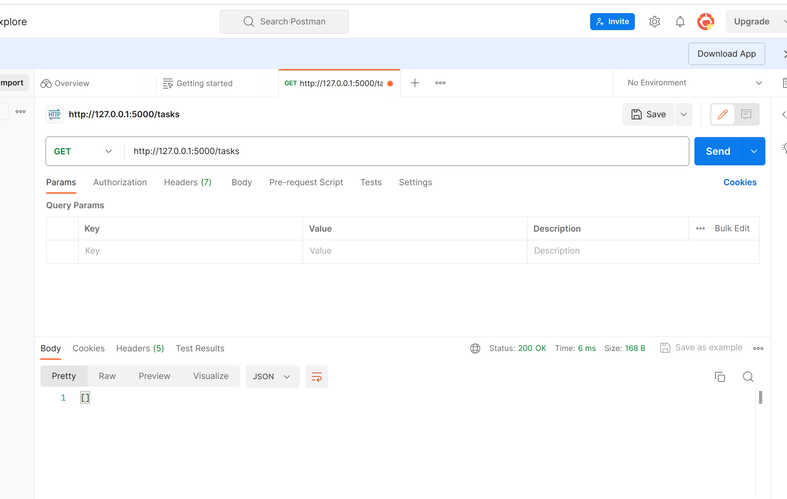
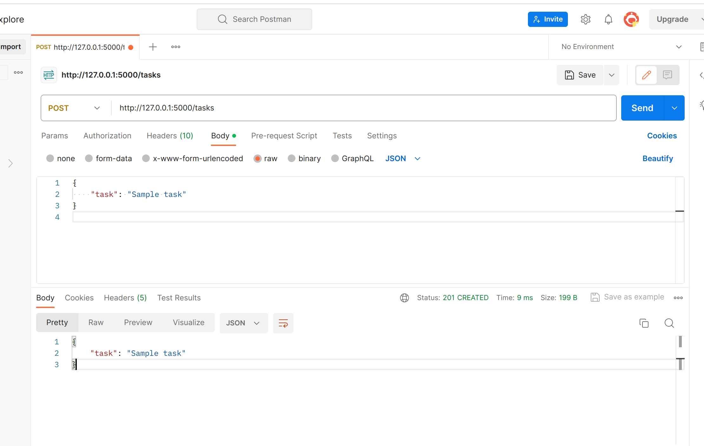
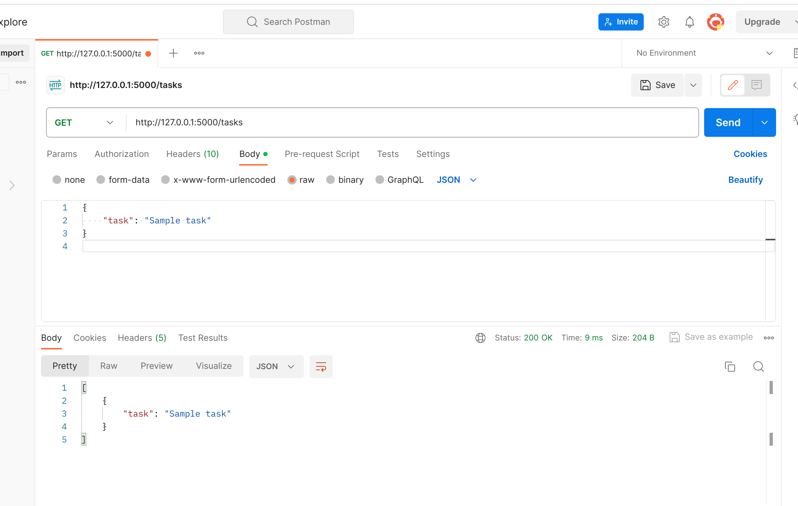

# RestAPI, Flask, Postman

Let us understand the whole ecosystem of how to build, document, and test APIs using a simple example based on Python. Steps to follow:

1. Install Flask using pip \
`pip install flask`

2. Create an app.py file using flask that defines two endpoints, we will test `GET` and `POST` requests: one for listing tasks and another for adding tasks.

```python
from flask import Flask, request, jsonify

app = Flask(__name__)

# Sample data to store tasks
tasks = []

@app.route('/tasks', methods=['GET'])
def get_tasks():
    return jsonify(tasks)

@app.route('/tasks', methods=['POST'])
def add_task():
    data = request.get_json()
    if 'task' in data:
        new_task = {'task': data['task']}
        tasks.append(new_task)
        return jsonify(new_task), 201
    else:
        return jsonify({'error': 'Task field is required'}), 400

if __name__ == '__main__':
    app.run(debug=True)
```

3. Run `app.py` \
This is the output you will see on `localhost:5000\tasks` url. 

4. Go to `web.postman.co` and create a new request. For a GET request, type `localhost:5000\tasks` in the URL and hit `Send`. You will see the following output with a 200 success code: \


 

5. Select `POST`, go to `Headers` and add a key-value pair `Content-type:application/json`. In addition, go to `Body` and add the following
```
{
    "task":"Simple Test"
}
```
Hit `Send`, you should see the results as follows:



This suggests that the task list has been appended with `Simple Test`. You can verify that by sending a `Get` request agai

